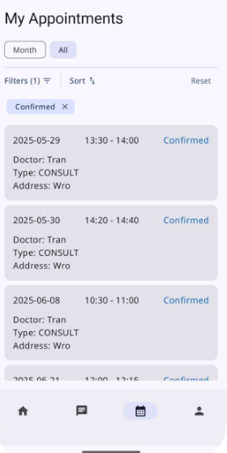

# CareConnect

An E-clinic app for android, this app is targeting for the hospital as the **admin** will be the manager/director of the hospital. The app provides an ability for the **doctors** to communicate with **patients** and be a safe place to store all their data to view it easier and quicker

  
   
  

## Technologies

This application is created with:
- Android studio
- Kotlin 2.1
- Jetpack composables + Material3
- Firebase
    + Firebase Authentication
    + Firestore Database
    + Firebase Storage
    + Firebase Cloud Messaging
    + Firebase Functions

## Features

1. Authentication
    * Admin account is created in backend database
    * Doctor is created only with Admin side using firebase functions
    * Patient can register using Email/Password Authentication or Google Authentication

1. Patient
    * Able to see and filter doctors by specialization
    * Able to view doctors's availability, timeslots and book(request) appointments
    * Able to view past/upcoming appointments, filter by status of appointments
    * Real-time chat with doctor, able to send files
    * Able to view prescriptions, medical reports, images,...
1. Doctor
    * Able to modify schedules and timeslots
    * Response to request appointments from patients
    * Able to view past/upcoming appointments, filter by status of appointments

1. Notifications
    * Sent to doctor when the patient request an appointment
    * Sent to patient after the doctor response and change information of the appointment

## Setup

1. Clone this repository
1. Create a Firebase project with Firebase console
1. Follow [these steps](https://firebase.google.com/docs/android/setup) to register the app in your Firebase project and add the Firebase Android configuration file
1. Create a Cloud Firestore database in your Firebase project
1. Enable Email/Password Authentication in your Firebase project
1. Enable Google login Authentication in your Firebase project
1. Run the app using Android Studio Meerkat+ on a device/emulator with API level 26 or above

## Database

### Firebase Cloud Firestore

Collections 
    
- admins: Responsible for managing the entire system, including adding and removing doctors, modifying doctor profiles, updating their availability schedules, and managing patient/user data.
- doctors: A medical professional who can update their profile information, set their availability for appointments, view scheduled consultations, and interact with patients via chat during e-consultations.
- patients: A general user who can register for an account, browse available doctors, book appointments, attend e-consultations via chat, view past consultations in their medical history, and upload/download medical documents such as prescriptions
- appointments: Appointments  (. ❛ ᴗ ❛.)
- chatrooms
- notification_triggers
- scheduled_notifications
- user_tokens

## Authors

- Quang Pham, Nerike Bosch
